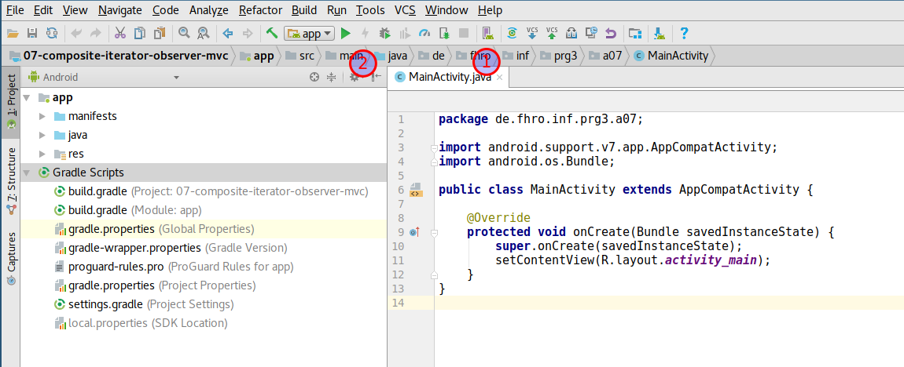
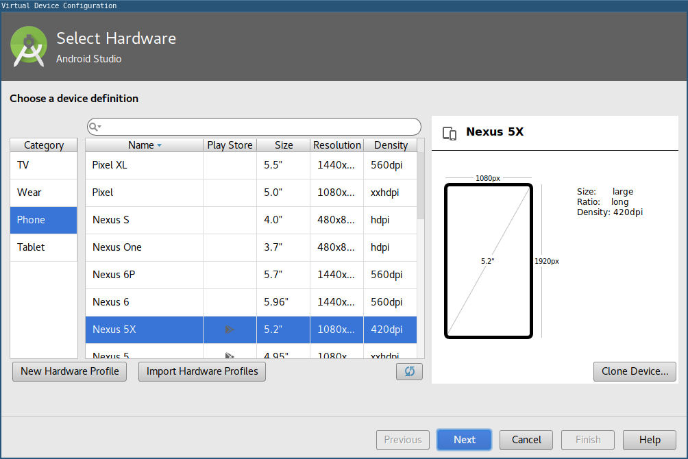
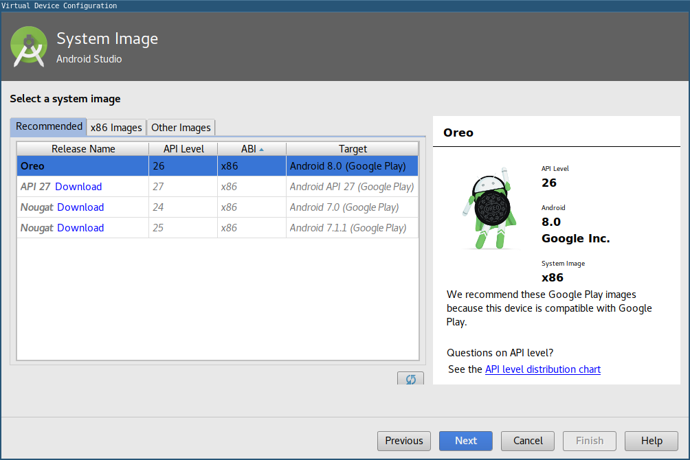
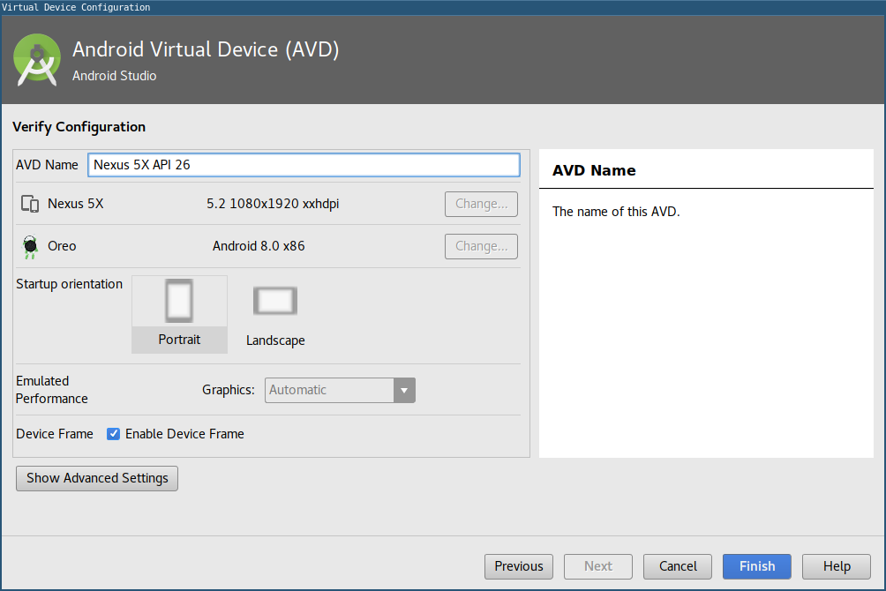

# Android Studio

To be able to run your app in the emulator you have to create a virtual device first.

To create this virtual device follow these steps:

1. Click the icon above number **1** in the first screenshot

2. Select the hardware model you want to use. You can go with the default model. _Warning: if you absolutely don't know what you're doing here take the default model!_

3. Select a System Image your virtual device will use. It's ok to take the newest. Which API level you're emulator has does not affect the API level of your app. _Warning: the images are relatively big (>1GB) so it's a good idea to load it at home if you don't want to wait for hours._

4. Finish the wizard. The default settings are fine for now.

5. You should have a virtual device now. Click the "Run" button above number **2** in the first screenshot to run your application. Android Studio will ask you which emulator it should use and will start it automatically. If you have any problems please let us know!