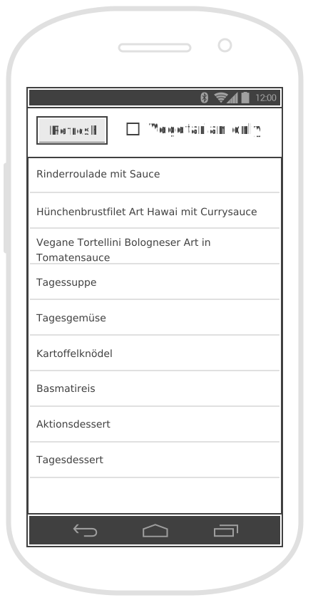
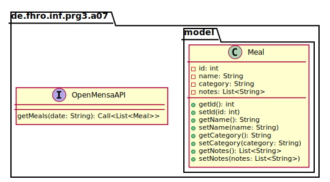

_This is an assignment to the class [Programmieren 3](https://hsro-inf-prg3.github.io) at the [University of Applied Sciences Rosenheim](http://www.fh-rosenheim.de)._

# Assignment 7: Composite, Iterator, Observer and MVC

First of all:


This assignment covers the first four design patterns we want to have a look at:

* Composite
* Observer
* MVC
* Iterator

The first three of them are often used when you implement graphical interfaces.
For this reason we implement a small Android app which displays the meals served at the contina at the current day.

## Setup

1. Create a fork of this repository (button in the right upper corner)
2. Clone the project (get the link by clicking the green _Clone or download button_)
3. Import the project to your Android Studio
4. Check the [Android Studio guide](./AndroidStudio-Guide.md) to create a virtual device and deploy the empty app for the first time

## Layout (Composite pattern)

At first we have to create the layout of the app.
The following wireframe shows how the app should look like when we are finished.



Layouts in Android are created by writing XML code.
The layouts are located in the path `app/res/layout`.
The layout `activity_main.xml` is already there but nearly empty beside the default code.

If you look at the [Android docs](https://developer.android.com/index.html) for design recommondations you'll notice that the `ConstraintLayout` is currently the preferred way to layout Android apps.
For now it may be easier to choose another layout, e.g.:

* LinearLayout
* GridLayout

### Basic layout

* Add a Button to your `activity_main.xml`
* Add a ListView to your `activity_main.xml`

Each element you want to interact with has to have an id.

* As we want to interact with both of them afterwards set ids. (Think of a naming convention you'll remember later when you need the ids.)

_Hint: the designer helps you to find all necessary widgets but depending on your chosen layout you might have to edit the generated code per hand afterwards._

_Hint 2: the container `ListView` is already scrollable so you don't have to care about this yourself_

### `ListView` element layout

The `ListView` needs a layout which it will use to display the elements in our list.

* Create a new **Layout resource file** in the `layout` folder, name it `meal_entry.xml` and set the `Root element` to `TextView`

## Application Logic

### OpenMensaAPI

The [OpenMensa API](http://doc.openmensa.org/api/v2/) is an API to retrieve the menu of a certain day of a certain canteen.
As last week we want to use [Retrofit](http://square.github.io/retrofit/) to interact with the API (don't worry you won't have to implement any TypeAdapters or anything else, it's straight forward this time).

* Add the method `getMeals` to the interface `OpenMensaAPI` (as shown in the following UML)
* Complete the test in the class `OpenMensaAPITests` to ensure that your implementation is working correctly



_Hint: as shown last week parameters of methods have to be mapped to parameters in the annotation. The inline comment in the interface shows the query string we want to produce. You'll get it where the date has to be inserted._

_Remark: the model you'll need is given._

### Displaying the meals (MVC and observer)

To be able to display the retrieved meals we need to put them into the `ListView` we created earlier.
To get a reference to the `ListView` use the Android specific mechanism like this:

```java
ListView mealsListView = findViewById(R.id.myListView);
```

The Android `ListView` class requires an adapter to interact with your list of meals.
The easiest way to get such an adapter is to use the Android built-in `ArrayAdapter<T>`.

* Create a reference to your `ListView`
* Create an `ArrayAdapter<>`
* Set the adapter of your `ListView` to your newly created `ArrayAdapter<>`

The next thing we have to implement is the _OnClickListener_ of the refresh button.
An OnClickListeners is a small classes which contains just one method which is called whenever a certain event occurs (in our case if the button is clicked).

To register an OnClickListener use the method `setOnClickListener` and hand the method an anonymous class over which implements the interface `View.OnClickListener`.

* Create a reference to your refresh-`Button`
* Register an OnClickListener
* Implement the OnClickListener as anonymous inner class
* Implement the logic to retrieve the meals of the current day in the `onClick` method of your OnClickListener

_Remark: Unlike in the last exercise and in the test case you're not allowed to use the `execute` method of Retrofit because Android does not allow network communication in the main thread. You have to use the `enqueue` method of Retrofit and pass a callback handler. This callback handler has to put the retrieved meals into your `ArrayAdapter<>`_

**Your app should now be able to display what you can eat after this assignment or what you might have eaten before this assignment!**

### Filter the meals

The last part is to implement the filter for vegetarian meals only.
Unfortunately does the API not expose any marker if a meal is vegetarian or not so we have to think about how to filter the list of meals otherwise.
On possible solution is to filter all notes of a meal for the word **fleisch** and exclude it if so.

_Hint: You might remember regular expressions from the last semester to check if a string matches a specific pattern._

* Add the checkbox shown in the wireframe to your `activity_main.xml` if you haven't already. Remember that you have to set an id if you want to interact with an element.
* Create a reference to your _vegetarian checkbox_
* Implement a `static` helper method which filters for vegetarian meals
* Change your `Callback` of the Retrofit call to filter for vegetarian meals if the checkbox is checked